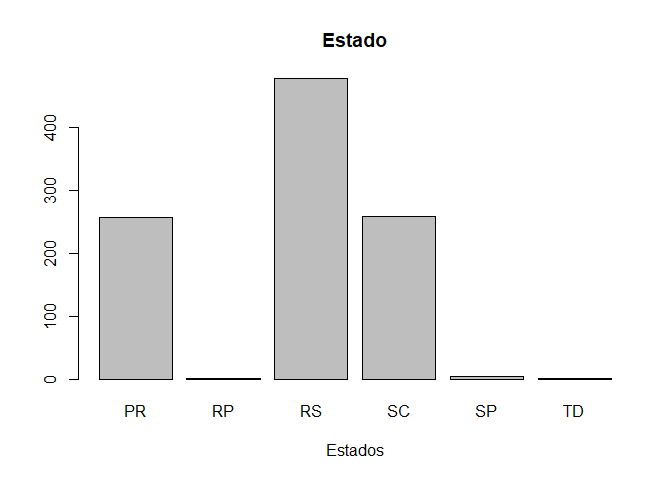
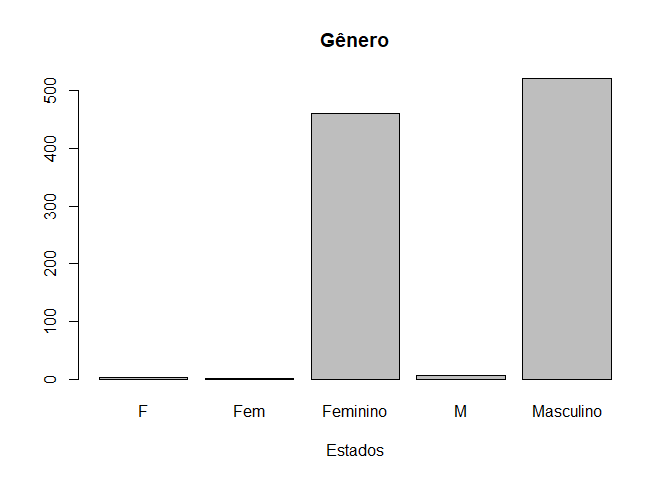
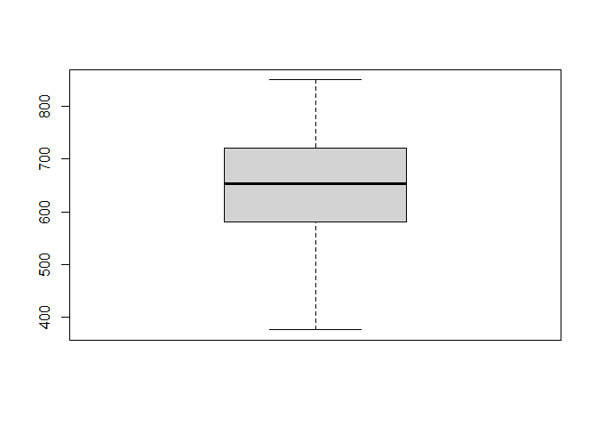
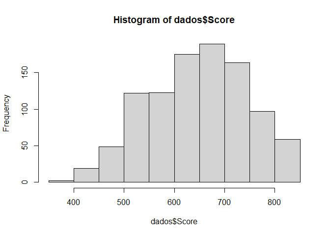
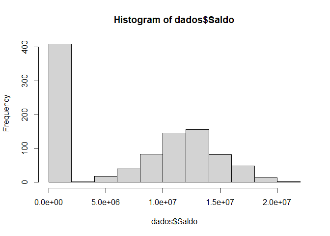

Limpeza e Tratamento com R
================

``` r
knitr::opts_chunk$set(echo= TRUE, results = 'markup', fig.path="figures/")
```

``` r
#importa dados, string vazio como NA, string como fatores
dados=read.csv("Churn.csv" , sep = ";"  ,na.strings = "" , stringsAsFactors = T)
summary(dados)#Fornece o valor mínimo e o valor máximo,quartis
```

    ##        X0               X1         X2              X3            X4       
    ##  Min.   :   1.0   Min.   :376.0   PR:257   F        :  2   Min.   :-20.0  
    ##  1st Qu.: 251.5   1st Qu.:580.0   RP:  1   Fem      :  1   1st Qu.: 32.0  
    ##  Median : 501.0   Median :653.0   RS:478   Feminino :461   Median : 37.0  
    ##  Mean   : 500.9   Mean   :648.6   SC:258   M        :  6   Mean   : 38.9  
    ##  3rd Qu.: 750.5   3rd Qu.:721.0   SP:  4   Masculino:521   3rd Qu.: 44.0  
    ##  Max.   :1000.0   Max.   :850.0   TD:  1   NA's     :  8   Max.   :140.0  
    ##                                                                           
    ##       X4.1              X6                 X7              X8        
    ##  Min.   : 0.000   Min.   :       0   Min.   :1.000   Min.   :0.0000  
    ##  1st Qu.: 2.000   1st Qu.:       0   1st Qu.:1.000   1st Qu.:0.0000  
    ##  Median : 5.000   Median : 8958835   Median :1.000   Median :1.0000  
    ##  Mean   : 5.069   Mean   : 7164928   Mean   :1.527   Mean   :0.7027  
    ##  3rd Qu.: 8.000   3rd Qu.:12586844   3rd Qu.:2.000   3rd Qu.:1.0000  
    ##  Max.   :10.000   Max.   :21177431   Max.   :4.000   Max.   :1.0000  
    ##                                                                      
    ##        X9              X10                 X11        
    ##  Min.   :0.0000   Min.   :9.677e+03   Min.   :0.0000  
    ##  1st Qu.:0.0000   1st Qu.:3.029e+06   1st Qu.:0.0000  
    ##  Median :1.0000   Median :8.703e+06   Median :0.0000  
    ##  Mean   :0.5095   Mean   :3.529e+07   Mean   :0.2032  
    ##  3rd Qu.:1.0000   3rd Qu.:1.405e+07   3rd Qu.:0.0000  
    ##  Max.   :1.0000   Max.   :1.193e+10   Max.   :1.0000  
    ##                   NA's   :7

``` r
head(dados) #Cabeçalho dos dados
```

    ##   X0  X1 X2        X3 X4 X4.1       X6 X7 X8 X9      X10 X11
    ## 1  1 619 RS  Feminino 42    2        0  1  1  1 10134888   1
    ## 2  2 608 SC  Feminino 41    1  8380786  1  0  1 11254258   0
    ## 3  3 502 RS  Feminino 42    8  1596608  3  1  0 11393157   1
    ## 4  4 699 RS  Feminino 39    1        0  2  0  0  9382663   0
    ## 5  5 850 SC  Feminino 43    2 12551082  1  1  1   790841   0
    ## 6  6 645 SC Masculino 44    8 11375578  2  1  0 14975671   1

``` r
#Nomeação de colunas
colnames(dados) = c("Id" , "Score" ,"Estado" , "Gênero" , "Idade" , "Patrimônio" , "Saldo", "Produtos" , "TemCartãoDeCrédito","Ativo" , "Salário" , "Saiu")
head(dados)
```

    ##   Id Score Estado    Gênero Idade Patrimônio    Saldo Produtos
    ## 1  1   619     RS  Feminino    42          2        0        1
    ## 2  2   608     SC  Feminino    41          1  8380786        1
    ## 3  3   502     RS  Feminino    42          8  1596608        3
    ## 4  4   699     RS  Feminino    39          1        0        2
    ## 5  5   850     SC  Feminino    43          2 12551082        1
    ## 6  6   645     SC Masculino    44          8 11375578        2
    ##   TemCartãoDeCrédito Ativo  Salário Saiu
    ## 1                  1     1 10134888    1
    ## 2                  0     1 11254258    0
    ## 3                  1     0 11393157    1
    ## 4                  0     0  9382663    0
    ## 5                  1     1   790841    0
    ## 6                  1     0 14975671    1

``` r
#Gráfico com a frequência de Estado
counts = table(dados$Estado)
barplot(counts,main="Estado" , xlab = "Estados")
```

<!-- -->

``` r
#Gráfico de frequência do gênero
counts=table(dados$Gênero)
barplot(counts,main="Gênero" , xlab = "Estados")
```

<!-- -->

``` r
#Explorar as colunas
summary(dados$Score)
```

    ##    Min. 1st Qu.  Median    Mean 3rd Qu.    Max. 
    ##   376.0   580.0   653.0   648.6   721.0   850.0

``` r
#Fornece os valores mínimo e máximo, junto com a mediana, e os quartis
```

``` r
boxplot(dados$Score)
```

<!-- -->

``` r
#Mostra a distribuição dos dados.
```

``` r
hist(dados$Score)
```

<!-- -->

``` r
#Mostra a distribuição
```

``` r
#Agora referente a coluna idade
summary(dados$Idade)
```

    ##    Min. 1st Qu.  Median    Mean 3rd Qu.    Max. 
    ##   -20.0    32.0    37.0    38.9    44.0   140.0

``` r
hist(dados$Idade)
```

<!-- -->

``` r
#Será representado uma anomalia, não há idade negativa
```

``` r
#Coluna do Saldo
hist(dados$Saldo)
```

<!-- -->

``` r
#Aqui, é possível concluir que uma frequência de 400 pessoas possui um saldo igual a 0
```

``` r
#Coluna do Salario
summary(dados$Salário)
```

    ##      Min.   1st Qu.    Median      Mean   3rd Qu.      Max.      NA's 
    ## 9.677e+03 3.029e+06 8.703e+06 3.529e+07 1.405e+07 1.193e+10         7

``` r
#Valores Faltantes serão completados com "NAS"
dados[!complete.cases(dados),]
```

    ##      Id Score Estado    Gênero Idade Patrimônio    Saldo Produtos
    ## 18   18   549     SC  Feminino    24          9        0        2
    ## 53   53   788     RS  Feminino    33          5        0        2
    ## 65   65   603     PR      <NA>    26          4 10916637        1
    ## 85   86   493     RS      <NA>    46          4        0        2
    ## 180 181   754     PR  Feminino    55          3 16160881        1
    ## 214 215   676     RS      <NA>    34          1  6309501        1
    ## 297 298   714     RS      <NA>    31          4 12516926        1
    ## 331 332   656     RS Masculino    50          7        0        2
    ## 371 372   801     SC      <NA>    42          4 14194767        1
    ## 427 428   492     PR Masculino    39         10 12457665        2
    ## 502 503   692     RS      <NA>    54          5        0        2
    ## 551 552   721     PR  Feminino    36          3  6525307        2
    ## 964 965   529     SC      <NA>    63          4  9613411        3
    ## 970 971   649     PR      <NA>    70          9 11685471        2
    ## 984 985   614     PR  Feminino    35          6 12810028        1
    ##     TemCartãoDeCrédito Ativo  Salário Saiu
    ## 18                   1     1       NA    0
    ## 53                   0     0       NA    0
    ## 65                   1     1  9284067    0
    ## 85                   1     0   190766    0
    ## 180                  1     0       NA    1
    ## 214                  1     1  4064581    0
    ## 297                  1     1 10663689    0
    ## 331                  0     1       NA    0
    ## 371                  1     1  1059829    0
    ## 427                  1     0       NA    0
    ## 502                  1     1  8872184    0
    ## 551                  1     0       NA    0
    ## 964                  1     0 10873296    1
    ## 970                  0     1 10712579    0
    ## 984                  0     0       NA    1
