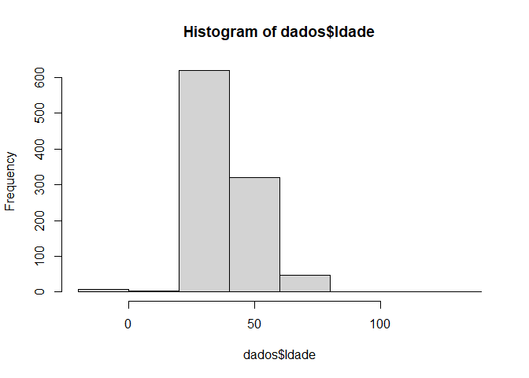

Exercício R
================

``` r
knitr::opts_chunk$set(echo= TRUE, results = 'markup', fig.path="figures/")
```

1.Crie duas variáveis Ana e Paulo e atribua a elas valores de suas
idades, sendo respectivamente 8 e 12 anos. As variáveis devem ser do
tipo inteiro. Imprima no console “A menina é mais velha” ou “O menino é
mais velho” como resultado de um teste lógico.

``` r
Ana = 8L
Paulo = 12L
if(Ana < Paulo){
  print("Ana é mais nova que Paulo")
}else{
  print("Ana é mais velha que Paulo")
}
```

    ## [1] "Ana é mais nova que Paulo"

2-BOD é um objeto existente no R. Verifique qual a classe deste objeto.

``` r
class(BOD)
```

    ## [1] "data.frame"

3-Crie um vetor que armazene números de 1 a 10 e posteriormente imprima
valores pares:

``` r
vetor<- c(1,2,3,4,5,6,7,8,9,10)

for(i in vetor){
  if(vetor[i]%%2 == 0){
    print(vetor[i])
  }
}
```

    ## [1] 2
    ## [1] 4
    ## [1] 6
    ## [1] 8
    ## [1] 10

4-Women é um dataframe existente do R.Imprima as 10 últimas linhas:

``` r
tail(women,n =10)
```

    ##    height weight
    ## 6      63    129
    ## 7      64    132
    ## 8      65    135
    ## 9      66    139
    ## 10     67    142
    ## 11     68    146
    ## 12     69    150
    ## 13     70    154
    ## 14     71    159
    ## 15     72    164

5-Crie dois vetores iguais, some as posições equivalentes dos vetores e
imprima o resultado:

``` r
numeros1 = c(1,2,3,4,5,6)
numeros2 = c(7,8,9,10,11)
print(numeros1 + numeros2)
```

    ## Warning in numeros1 + numeros2: comprimento do objeto maior não é múltiplo do
    ## comprimento do objeto menor

    ## [1]  8 10 12 14 16 13

6-Imprima o número de linhas, de colunas,nome das linhas, nomes das
colunas do conjunto de dados CO2:

``` r
dim(CO2)[1]  
```

    ## [1] 84

``` r
dim(co2)[2]
```

    ## NULL

``` r
rownames(CO2)
```

    ##  [1] "1"  "2"  "3"  "4"  "5"  "6"  "7"  "8"  "9"  "10" "11" "12" "13" "14" "15"
    ## [16] "16" "17" "18" "19" "20" "21" "22" "23" "24" "25" "26" "27" "28" "29" "30"
    ## [31] "31" "32" "33" "34" "35" "36" "37" "38" "39" "40" "41" "42" "43" "44" "45"
    ## [46] "46" "47" "48" "49" "50" "51" "52" "53" "54" "55" "56" "57" "58" "59" "60"
    ## [61] "61" "62" "63" "64" "65" "66" "67" "68" "69" "70" "71" "72" "73" "74" "75"
    ## [76] "76" "77" "78" "79" "80" "81" "82" "83" "84"

``` r
colnames(CO2)
```

    ## [1] "Plant"     "Type"      "Treatment" "conc"      "uptake"

7-Use a função plot do R para produzir um gráfico dos atributos
Sepal.width e Petal.length do conjunto de dados Iris.O gráfico deve
imprimir as linhas de 50 até 100 apenas.

``` r
novairis = iris[50:100,c(2,3)]
plot(novairis)
```

<!-- -->
